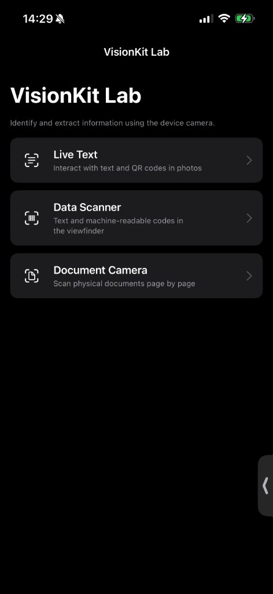
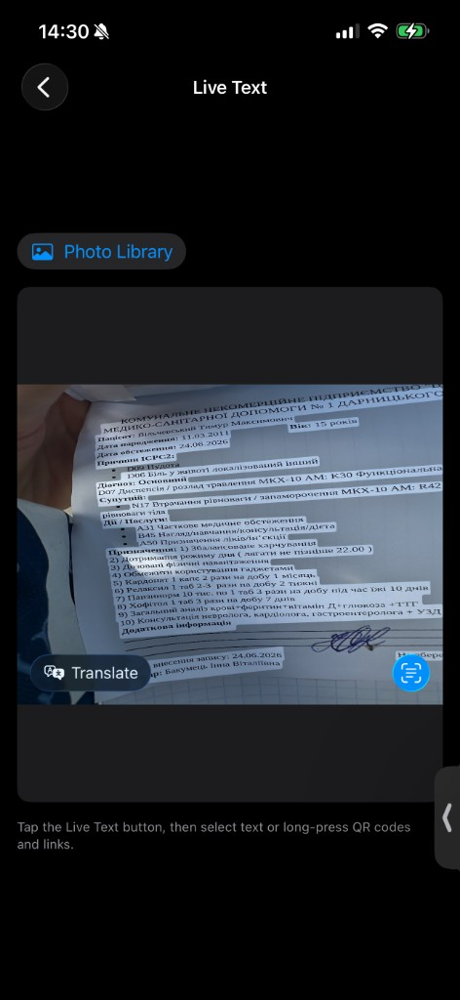
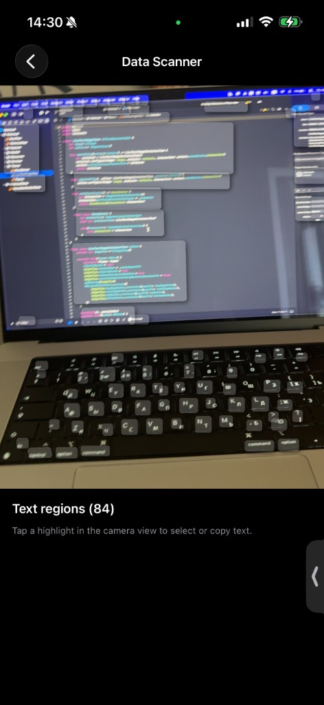
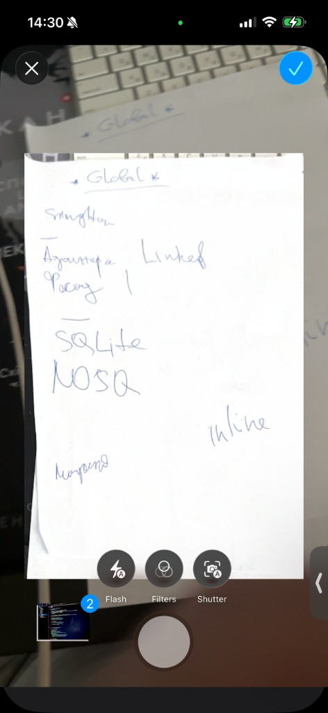

# VisionKit Lab

On-device iOS lab that demonstrates [Apple VisionKit](https://developer.apple.com/documentation/visionkit) camera and image interfaces for recognizing text, barcodes, and documents.

## Stack

iOS 17+ · Swift 6 · SwiftUI · VisionKit · Swift Testing

## Screenshots

| Home | Live Text |
|------|-----------|
|  |  |

| Data Scanner | Document Camera |
|--------------|-----------------|
|  |  |
